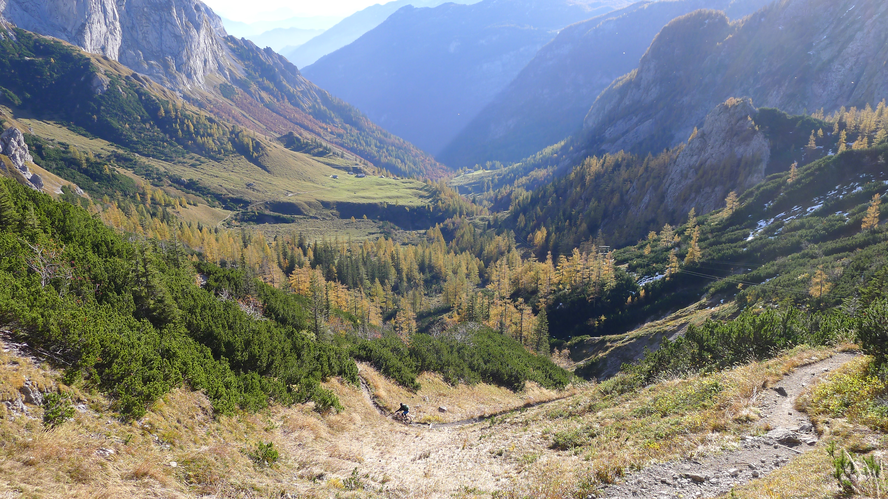
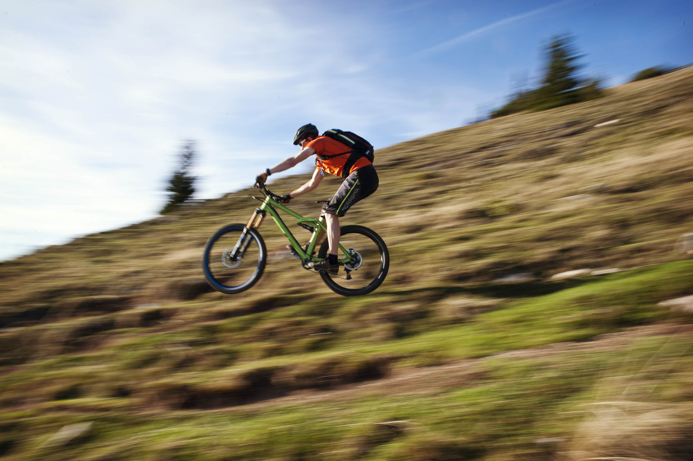
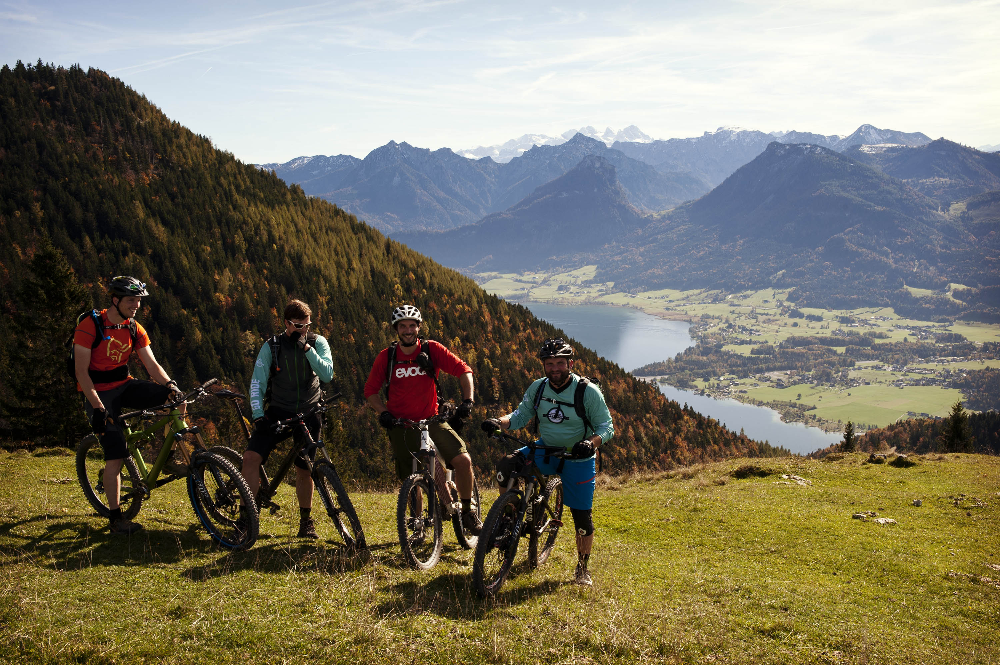
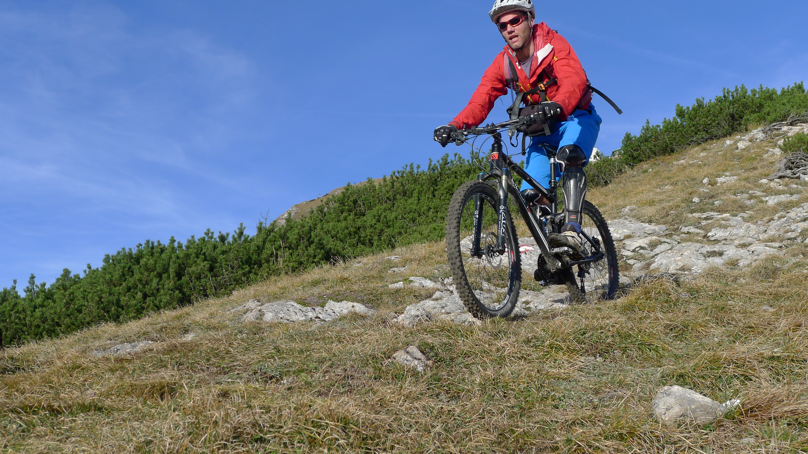
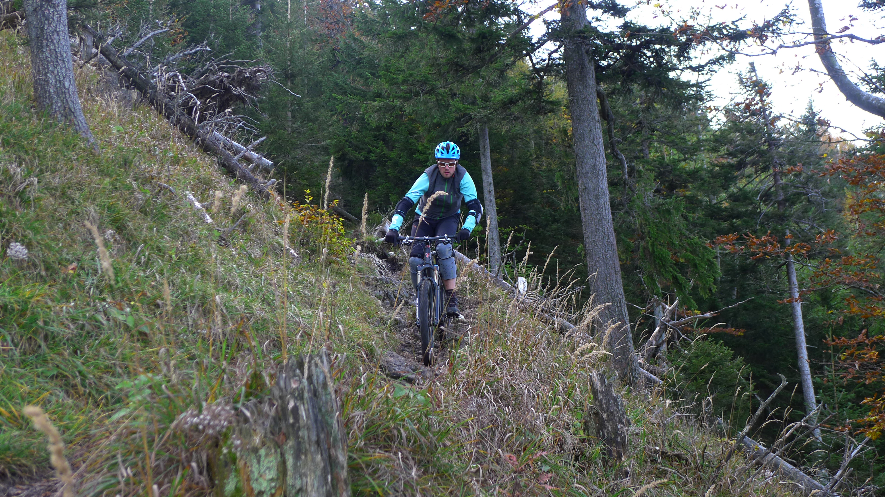
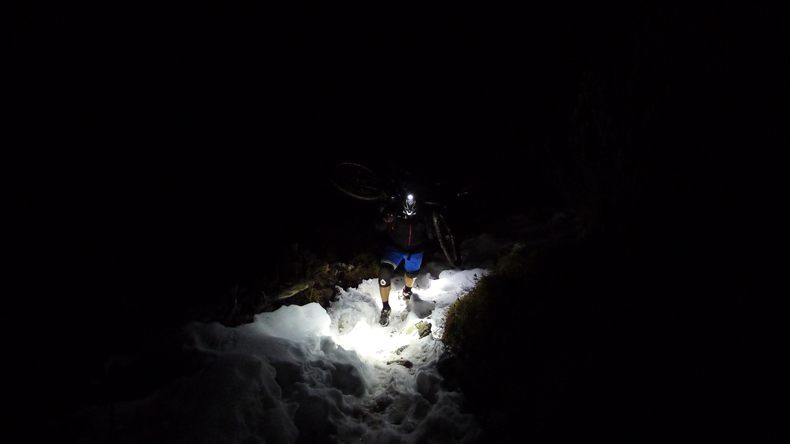
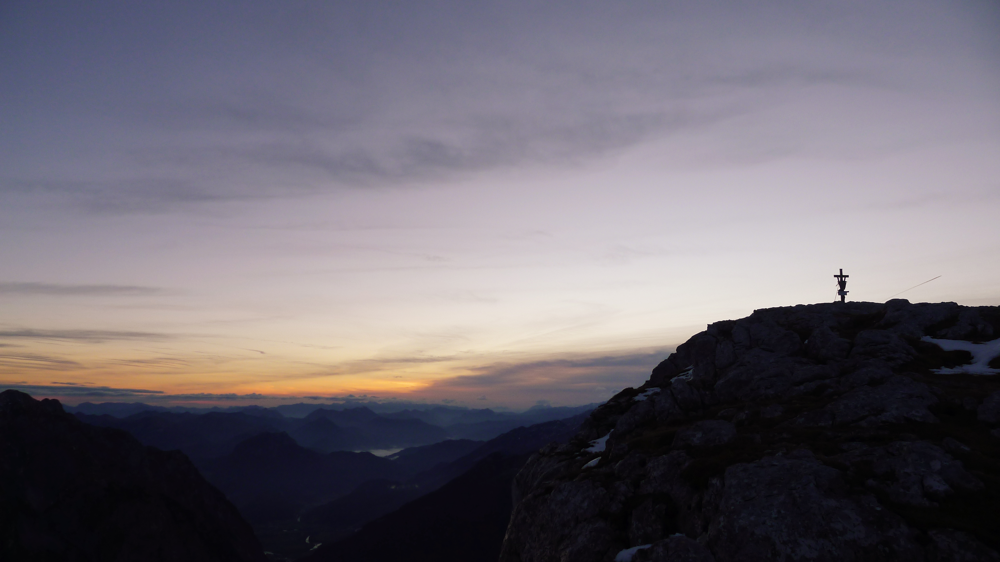
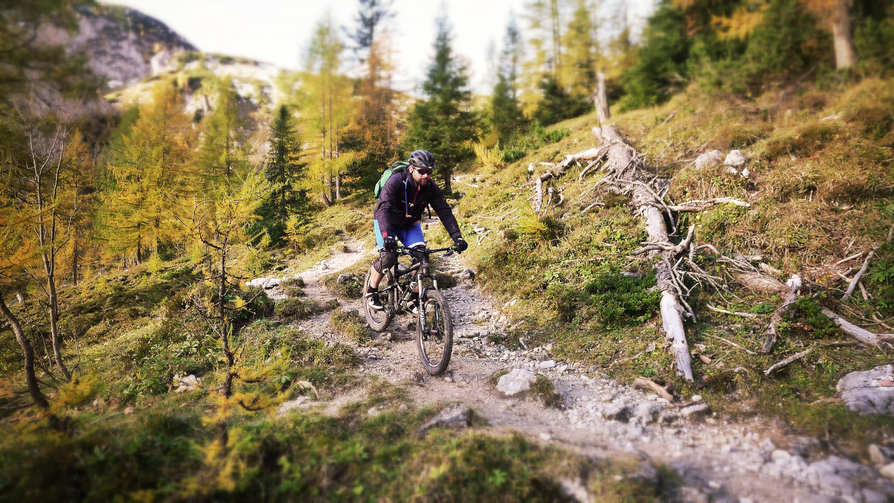

# Freitag 

Freitagnachmittag, kurz vor Nürnberg auf der A6: Stau – kann’s was Schöneres geben? Wir sind auf dem Weg von Heidelberg nach Salzburg zum Jedda Invitational, dem inoffiziellen Abschluss der Big Mountain Saison 2013 von Heidelberg’s Finest Mountainbike Trails.

 

Als wir gegen 20 Uhr endlich bei unserem Gastgeber ankommen gibt‘s Pasta Mexico. Andy ist Biker und kein Koch. Egal – das Bier ist kalt, die Stimmung bestens und in den kommenden drei Tagen werden sowieso Trails vom Feinsten serviert.

 

# Samstag

Am Samstag geht‘s Richtung Wolfgangsee. Dort haben Heidelberg’s Finest noch eine Rechnung offen. Vor mehr als 6 Monaten war Andy hier schwer gestürzt aber heute soll es besser laufen. Neben Andy, Tobi und Mark von Heidelberg’s Finest Mountain Bike Trails sind auch ein paar Locals aus Salzburg am Start. Wir schwingen uns aufs Rad und genießen das wolkenlose Panorama und die Laubfärbung, die mit jedem Höhenmeter mehr ins Auge sticht. Bis zur Baumgrenze kommen wir gut voran, dann müssen wir die Bikes schultern und geduldig Fragen von immer mehr ungläubigen Wanderern beantworten. Der Gipfel wird auch von einer Bergbahn bedient und je näher wir unserem Ziel kommen, umso mehr ist auch los auf den Trails.

 

Oben angekommen gönnen wir uns ein ordentliches Vesper. Erst nachdem der Trubel auf den Trails etwas nachgelassen hat und die Sonne tiefer steht, wollen wir abfahren. Wir müssen nicht lange warten, bevor wir die Abfahrt für uns haben. Der Trail ist erste Sahne – schnelle Abschnitte wechseln sich mit technischen Sektionen ab. Wir sind alle gut im Flow und Andy meistert die Schlüsselstelle, an der er vor sechs Monaten Lehrgeld zahlen musste. Viel zu schnell sind wir wieder zurück am Trailhead aber bevor wir uns wieder auf den Heimweg machen gibt‘s noch für jeden ein warmes Bier aus dem Auto. Was soll‘s – das Grinsen kriegt heut keiner mehr aus unserem Gesicht.

 

# Sonntag 

Sonntagmorgen schlafen wir nicht aus, früh morgens wird geshuttelt. Wir wollen uns an der knackigsten Abfahrt von Salzburgs Hausberg versuchen. Das Ding entpuppt sich als wirklich harte Nummer. Wir packen uns mehrfach auf die Fresse, aber im zweiten und dritten Anlauf lassen sich die meisten kniffligen Passagen fahren. Nur bei einigen wenigen Spitzkehren, die mit Holzleitern versichert sind, müssen wir absteigen. Bevor wir zurück nach Salzburg rollen, machen wir noch den ein oder anderen Abstecher, nehmen ein paar Switchbacks mit und surfen über herbstlich laubige Trails.

 

Leider bleibt uns nicht mehr Zeit um weitere Trails direkt um Salzburg abzuchecken; heute Abend wollen wir auf knapp 1800 Metern übernachten und bis dahin sind noch einige Höhenmeter zu bewältigen. Also zurück zu unserem Quartier, Rucksack für die Zweitagestour packen, die Reste an Pasta Mexico einwerfen und ab auf die Autobahn Richtung Süden.

Gegen 13 Uhr sind wir startklar. Der Aufstieg beginnt moderat. Wir fliegen durch die Talsohle vorbei an idyllischen Seen und lassen die Wandergruppen, die sich mittlerweile schon wieder auf dem Rückweg befinden, hinter uns. Abrupt beginnen nicht enden wollende, gnadenlose Serpentinen. Das Terrain saugt uns ordentlich Kraft aus den Waden, bevor die Steigung wieder leicht nachlässt. Nachdem jetzt das Schlimmste eigentlich geschafft ist, fängt Tobis Schaltung an zu zicken. Aber es gibt kein Zurück mehr. Unser Nachtquartier ist nicht mehr weit und wenn wir Gas geben, sehen wir vielleicht noch den Sonnenuntergang an der Hütte. Leider machen uns dichte Wolken im Westen einen Strich durch die Rechnung.

 

Bei Schweinsbraten und Knödel treffen wir den Entschluss gegen 4 Uhr morgens aufzubrechen, um den Sonnenaufgang auf einem nahen Gipfel zu erleben. Die Hüttenwirtin hält von unserem Plan, die Bikes mit auf den Berg zu nehmen, herzlich wenig und insgeheim nimmt sie uns wahrscheinlich auch nicht ab, dass wir vor Sonnenaufgang auf den Beinen sein werden.

 

# Montag

Aber als unser Wecker klingelt, gibt es keinen Zweifel: Das ziehen wir jetzt durch. Mucksmäuschenstill verlassen wir die Hütte und beginnen im Schein der Stirnlampen den Aufstieg. Wir schieben und tragen das Rad. Fahren? No Way. Vor kurzem kam der erste Schnee und dort wo der Steig nicht komplett bedeckt ist von der weißen Pracht, ist er total aufgeweicht und bietet nur wenig Traktion. Mühsam arbeiten wir uns nach oben und nach der dritten Steilstufe unter Schnee und Eis beschließen wir die Bikes zurück zu lassen. Ohne Räder auf dem Rücken kommen wir gut voran und sind kurz vor Sonnenaufgang am Gipfel. Aber heute bekommen wir keine Postkartenmotive serviert. Dichte Wolken im Osten nehmen die Sicht auf den Horizont. Dennoch werden wir alle den ganzen Winter über von diesem Moment zehren. Wir haben einiges investiert, um eben diesen Sonnenaufgang zu sehen. Dass es nicht der klassische Farbporno in Rot und Orange ist macht uns wenig. Wir beobachten wie sich Farbnuancen am Horizont langsam verändern und ein neuer Tag in den Berchtesgadener Alpen beginnt. Leider ist es für eine wirklich lange Pause an so exponierter Stelle zu windig. Auf dem Abstieg zur Hütte geht dann jeder sein eigenes Tempo. Vielleicht nur ein Zufall, aber vielleicht wollte auch jeder kurz die Einsamkeit genießen. 

 

Zurück am Bikedepot zögern wir kurz: Macht es Sinn die Protektoren anzulegen oder müssen wir sowieso das meiste Tragen? Wir lassen es darauf ankommen und versuchen uns an überschaubaren Stellen im Tiefschneefahren. Schnell finden wir Gefallen daran. Manchmal finden unsere Pneus guten Grip im Schnee, manchmal geht’s auf allen Vieren bergab. Das letzte Stück zur Hütte, vielleicht gerade mal 300 Meter lang, ist aber ein absolutes Fest. Der Trail ist hier vielleicht 30cm breit, absolut flowig, garniert mit ein paar kleinen Kickern, und verläuft direkt auf dem Kamm mit brillanter Aussicht. Unser Auftritt vor der Hüttenwirtin sitzt. Sie hat gerade die letzten Frühstücksgäste verabschiedet und als sie uns sieht, bietet sie spontan an, das Frühstück ausnahmsweise auf der Terrasse zu servieren. Wir nehmen dankend an und machen es uns in der Sonne gemütlich.

 

Gegen 9 Uhr morgens verlassen wir die Hütte zum zweiten Mal. Das erste Stück bergab bis zur Hochalm entspricht dem gestrigen Aufstieg. Wir wissen also was kommt und können es teilweise ordentlich laufen lassen. Uns allen bringt der Trail eine Menge Spaß und schon um 9.30 Uhr morgens steht fest, dass heute ein genialer Bike Tag war. Nach der Hochalm landen wir auf einem ziemlich zerbombten Trail. Flow ist anders, aber auch diese Feste wollen gefeiert werden in den Alpen. Der Steig verlangt uns einiges ab und als wir endlich zurück am Trailhead sind, schmerzen Schultern und Handgelenke von der Abfahrt.

 

Bei der abschließende Runde Kaspressknödel sind wir uns einig: Es waren gelungene drei Tage rund um Salzburg. Wir hatten eine Menge Spaß auf und neben den Trails und darüber hinaus genügend Zeit um große Pläne für 2014 zu schmieden.
