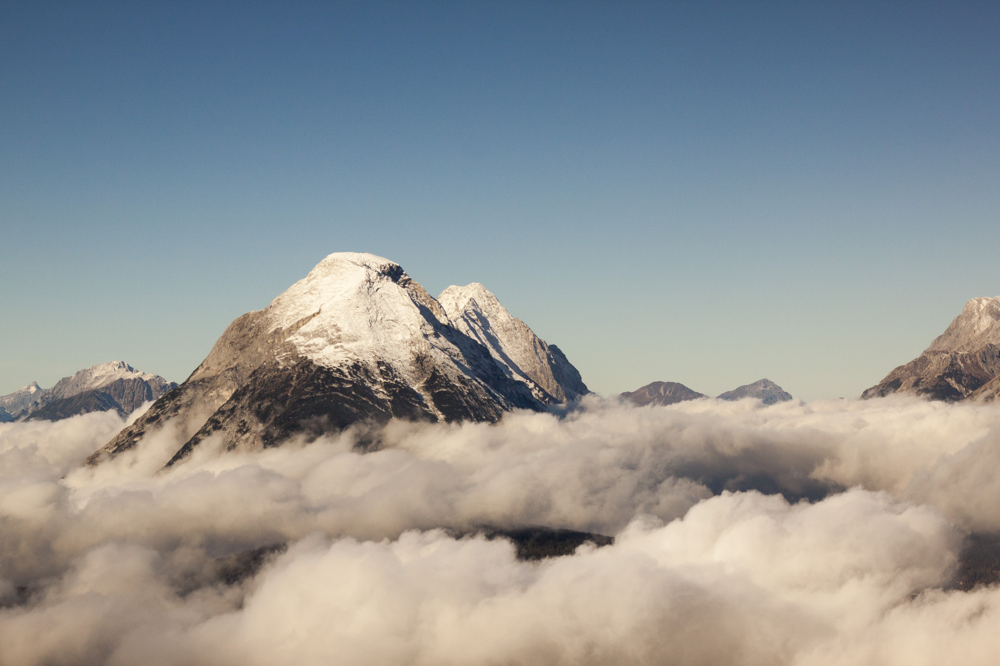
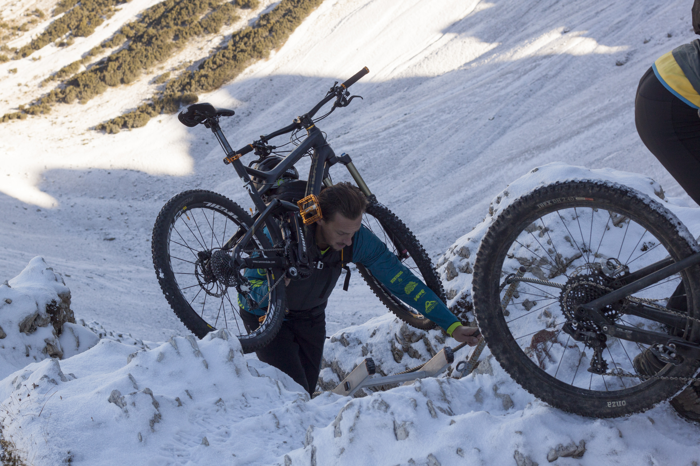
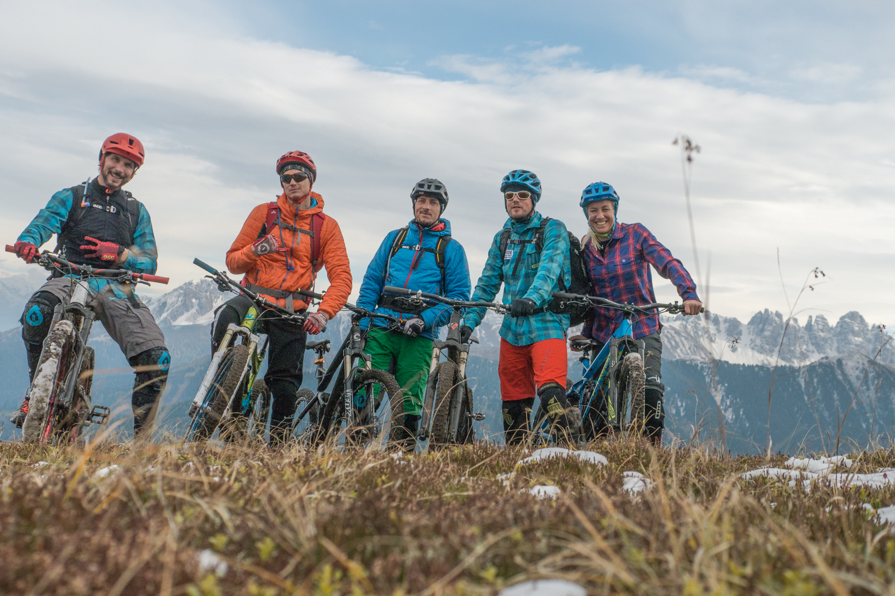
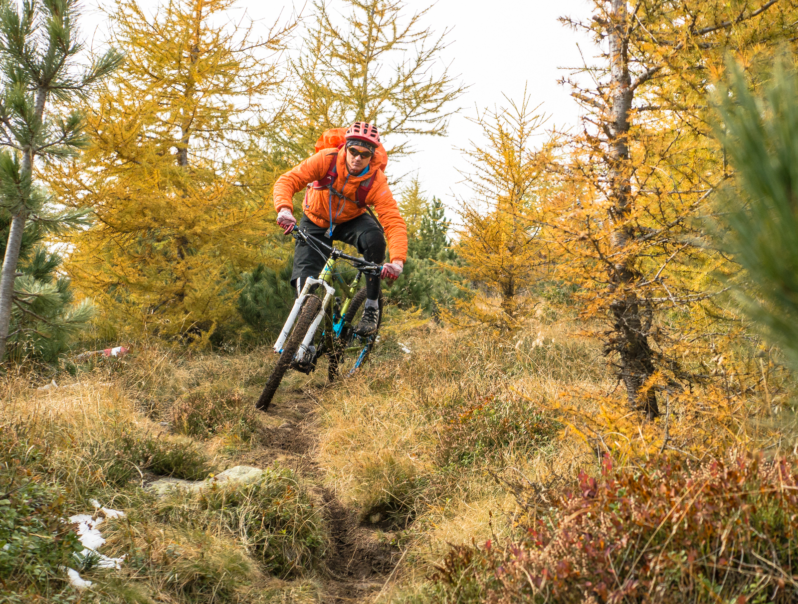

# Tag1: Reither Spitz

Unteralpt. Das war Marks Situation im Jahr 2016. Wir hatten zwar im Sommer schon ein paar intensive Tage. Aber der Hunger wollte auch im Herbst nochmal gestillt werden.

Zu der Zeit war ich regelmäßig mit Flo und Andrea unterwegs und so war klar, dass die beiden auch am Start sind. Als Überraschungsgast wurde mein alter Freund aus Kindertagen Björn gecastet, der sich in der letzten Zeit auch immer mal wieder im Heidelberger Raum blicken ließ. Insgesamt somit also zu fünft. Das Zeitfenster war kurz. Zwei Tage, um genau zu sein. 
 
 
<iframe src="https://www.komoot.de/tour/1016808103/embed?share_token=a1b73E18U399V7M86lMlrUD4RRF7KbvZBc2RQ79P14RnA6hA5U&profile=1" width="100%" height="700" frameborder="0" scrolling="no"></iframe>
 
 
Im Verlauf des Jahres hatte ich schon mal mit Andrea die Tour um die Reither Spitze gemacht und als „ absolut ballernswert“ klassifiziert. Und somit war der erste Tag schon gesetzt.
Damit wir morgens direkt früh loskommen, checkten wir schon freitags in unserer Unterkunft ein in Zirl ein. Die Nächte waren kalt und es war sogar Schnee gemeldet in höheren Lagen. Wir waren etwas aufgeregt, wie viel es wohl tatsächlich sein würde. Für den Tag war jedenfalls Sonne versprochen.

Samstags fuhren wir mit den  Autos zur Bahn im Seefeld und nahmen die Liftunterstützung gern an. Oben war dann tatsächlich alles angezuckert und in Kombination mit dem blauen Himmel eine tolle Kulisse. 

Wir machen uns zügig auf den Weg durch den Kessel. An Fahren war hier nicht zu denken und so schoben wir unsere Räder in erster Linie bis kurz unter den Übergang, wo wir dann nochmal kurz Pause machten. Hier galt es noch eine Stahlleiter mit den Bikes auf dem Rücken zu überwinden und dann den Gipfelaufbau in Angriff zu nehmen. Die Schneemenge hielt sich in sehr überschaubaren Grenzen und so war es vor allem ein Schmankler fürs Auge. Genau wie der Ausblick ins Karwendel vom Gipfelkreuz aus. Nach einigen Erinnerungsfotos machten wir uns auf die Abfahrt. Der erste Teil bis zur Nördlinger Hütte war noch sehr verblockt, aber was dann kommen sollte, werdet ihr nicht glauben…

Endloser Abfahrtsspass mit allem was Biken in den Alpen zu bieten hat: felsige Alpenkulisse, technische Passagen, Latschenflow, Wurzelabschnitte durch sonnendurchfluteten Nadelwald. 

Ziemlich gestocked spuckt uns der Trail irgendwann am späten Nachmittag wieder in Zirl aus. Erstmal ein Eis und dann noch die Autos zurückholen. Noch Abendessen im Örtlichen Gasthaus und Tag1 war erfolgreich im Kasten.
 
 
 
# Tag2: Kögele im Sellrain
 
Für Tag zwei war ich mir noch nicht ganz sicher. Die Stubaier Alpen lagen direkt vor uns und lockten mit ihren Reizen. Ebenso das Sellraintal. Allerdings musste man davon ausgehen, dass in höheren Lagen deutlich mehr Schnee runterkam. Letztendlich entschieden wir uns für‘s Kögele am Anfang des Sellrains. So konnten wir immerhin die Kulisse der hohen Berge genießen, kamen aber nicht so hoch, dass wir Probleme mit dem Schnee haben sollten. 
 
 
<iframe src="https://www.komoot.de/tour/1016798629/embed?share_token=akD0nUcGi2pPEXrR5ruzZocqZ3Rbn4N7ByhLnMbdylMER0vEs8&profile=1" width="100%" height="700" frameborder="0" scrolling="no"></iframe>
 
 
Die Auffahrt Ging gut über Forststrassen und nur eine letzte Querung war nicht fahrbar. 

Danach folgte dann herbstlicher Abfahrtsspass mit Vollgasgarantie. Wir flogen den Rücken des Kögele hinab über grasige Wiesen- und buntgefärbte Waldtrails. Erst am Auto hörte der Rausch auf. Jetzt noch kurz Bikes reinigen und ab nach Hause. Mission erfolgreich.

