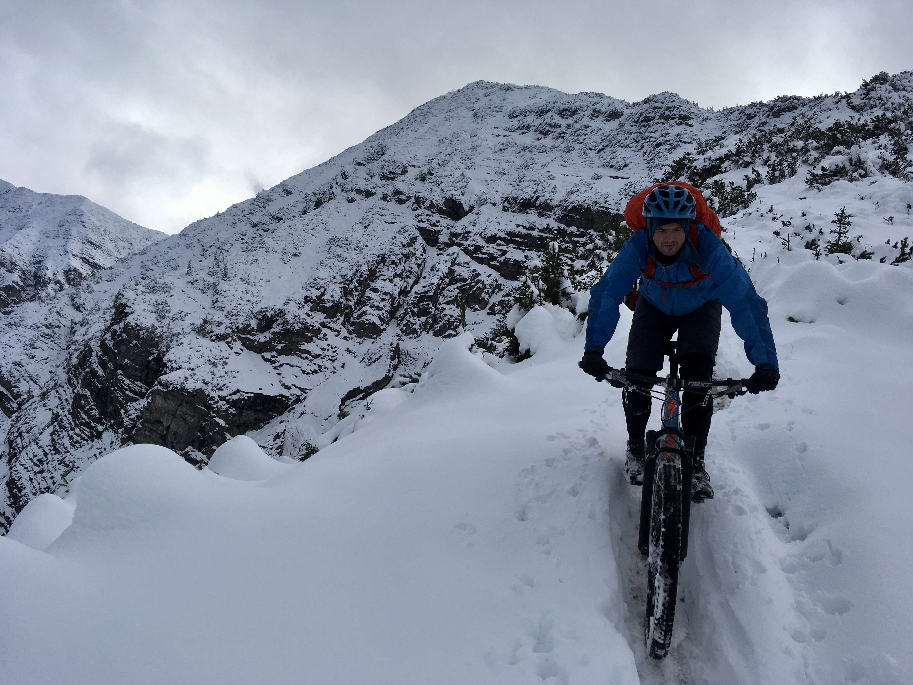
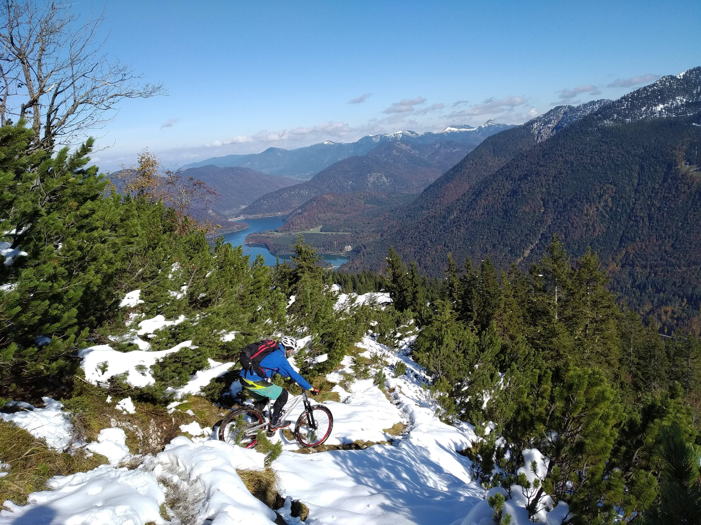

Brutal wie hart Corona in diesem Herbst wieder genervt hat. Ständig fielen Pläne ins Wasser, andauernd war jemand krank, die letzten Einschränkungen waren ätzend aber notwendig. Keiner hatte mehr Durchblick, was erlaubt, vernünftig oder vertretbar war. Soziale Kontakte waren weiterhin auf ein Minimum beschränkt und so hatten auch Mark und ich uns seit der letzten Baller Quarantäne nur digital getroffen und da fliegt der Dreck leider auch nur bedingt um die Ohren. Wir waren also mental mehr als bereit für Bikeaction und die Pandemie hatte uns immerhin dank des Runner Joints mit ausreichend Grundlagenausdauer versorgt. Und so war klar, wir erlauben uns eine kleine Quarantäne innerhalb Deutschlands und versuchen unsere Kontakte einfach auch in diesem Fall auf ein Kleinstmaß zu beschränken. Wir planten, kurz und schnell zuzuschlagen. Anreise Samstag; direkt los ballern; Übernachtung in einem Chalet (JA EIN CHALET!) in Bad Tölz ohne Personenkontakt; Verpflegung über einen ToGo-Service; Ballern am Sonntag und dann wieder ab nach Hause.

Alles, was wir jetzt noch brauchten, für unser kurzweiliges Glück war angemessenes Wetter. Indian Summer. Colors. Wir pflügten mit den Pneus durch bunt gefärbte Blätter, die Herbstsonne im Gesicht! Soweit unsere Vorstellung. Der Wettergott hatte anders geplant und war der Meinung, was uns für einen kühlen Kopf im Coronawinter wäre, eine satte Packung Herbstschnee. Auch gut. Ein bisschen Schnee schüchtert die Ballerboys bekanntermaßen so schnell nicht ein.
 
 

# Tag 1: Schürpfeneck

Eine meiner Lieblingstouren im Bayerischen Backyard wartete noch darauf, präsentiert zu werden und ich hoffe, dass auch die Exposition und die Höhe mit den Neuschneemengen gut passen könnten. Die Tour führt sanft im Anstieg über Waldwege bis der Weg irgendwann endet und man querfeldein durch den Wald aufsteigen muss, bis man wieder auf den Trail kommt. Erfahrungsgemäß ein etwas unwegsames Stück und es zeigte sich, dass kurz unterhalb des Wald-Einstiegs die Schneefallgrenze lag. Und so fanden wir uns wieder in einem steilen Waldstück in doch recht tiefem Schnee. Mein Begleiter machte seinen Coronafrust Luft und schimpfte wie ein Rohrspatz bevor er Rücklings im Schnee lag und sich ein breites Grinsen breit machte. Wir akzeptierten die Umstände und begannen zu genießen: Das wir mal wieder gemeinsam unterwegs waren; überhaupt das man mal wieder jemand ganz in Ruhe treffen kann und genug Zeit zum Plaudern hat; in den Bergen zu sein; mit den Bikes unterwegs zu sein und die winterliche Kulisse bei blauem Himmel war schon auch einfach mit 4/4 herrlich zu bewerten.
 

{{ imageGrid([
 ["Ballerquaranaene10182020114331.jpeg"],["Ballerquaranaene10182020125312.jpeg"]
]) }}
 
Am Sattel angekommen waren wir überrascht über die Schneemenge und vor allem die Querung war recht mühsam mit dem tiefen Schnee, aber immer zeichnete sich ab, dass die Abfahrt möglich sein sollte und der Boden halbwegs griffig. Die Abfahrt über den Rücken war der reinste Genuss und wir hatten eine Mordsgaudi.

Perfekt, um den Kopf frei zublasen. Im weiteren Verlauf kamen wir dann auch noch auf unsere Kosten was unsere Indian Summer Träume angeht: trockener Waldboden, Sonne, Seeblick und buntes Laub. Ziemlich zufrieden kamen wir bei unserem Chalet an. Abends gab es noch Curry vom Inder ums Eck und Trailplanung für den nächsten Tag. Die vorgesehene Tour war bei den aktuellen Bedingungen doch zu heikel und so musste eine Alternative her.
 
 

# Tag 2: Kotzen und weiter

Wir entschieden uns für den Kotzen - ein kleinen Gipfel bei Lenggries mit südlicher Exposition. Dafür allerdings mit 100% Trageanteil im Aufstieg. Der untere Teil war zwar feucht, dafür sonnig. An einer Lichtung machten wir nochmal Halt in der Sonne. Mittlerweile lag auch hier überall Schnee und es zeichnete sich ab, dass hier noch nicht so viele Wanderer unterwegs waren. 

 

{{ imageGrid([
 ["Ballerquaranaene10192020110120.jpeg"],["Ballerquaranaene10192020111553.jpeg"]
]) }}
 

Ob der gesamte Gipfelaufstieg mit dem Bike wirklich sinnvoll ist, war zweifelhaft. Egal. Die Stimmung war bestens und wir entschieden einfach so weit zu gehen, wie es uns als Abfahrts geeignet erschien und so kamen wir bis kurz ca 100 hm unterhalb des Gipfels bis wir kehrt machten und uns auf unsere Bikes setzen. Die Abfahrt war Zucker! 

Unten im Talboden entschieden wir, direkt auf der anderen Seite nochmal hoch zu fahren und einen weiteren Trail auszuprobieren, der sich dann auch noch als Schmankerl herausstellte.
 

 
Glücklich und zufrieden kamen wir am Nachmittag wieder am Auto an. Auch wenn alles etwas anders lief als geplant, wurde unser Wunsch nach Abwechslung erfüllt und wir waren gewappnet für den Alltagswahnsinn des Winters in diesem Jahr. Quarantäne sei Dank.
