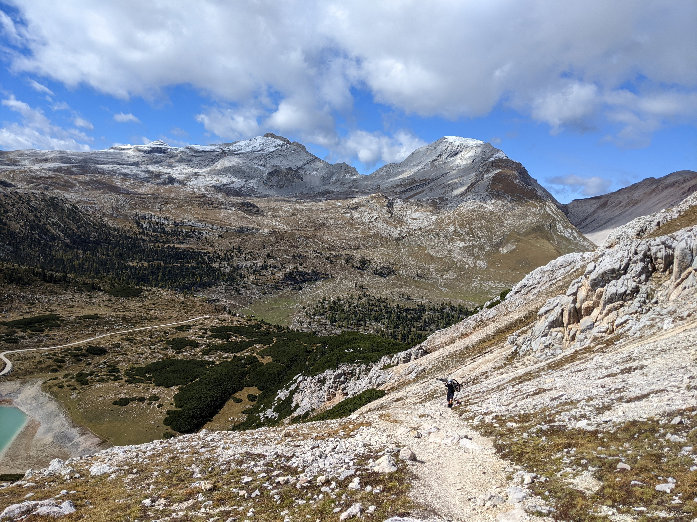

  
# Montag 26. September

Die Wettervorhersage für St. Moritz am 1. Oktober schaut nicht mehr so prickelnd aus. Summa summarum 30 cm Schnee soll die Tage auf 3000m fallen. Südtirol wird als Alternative immer ernsthafter diskutiert. Nur das macht uns Elmar, Andys Local aus Toblach, auch nicht unbedingt schmackhaft mit Bildern vom verschneiten Grödner Joch und Rückfragen bezüglich unserer Konzentrationsausdauer. Wenn der wüsste.
 
 

# Mittwoch 28. September

Die Entscheidung fällt für Südtirol. Die Webcams schauen gut aus und die Wettervorhersage passt auch in weiten Teilen. Elmar hat Zutrauen in unsere Fähigkeiten gefunden und macht die Endabnahme unserer Tourenplanung. Da mussten leider auf den letzten Metern nochmal Modifikationen gemacht werden, weil die Dürrensteinhütte auf der Plätzwiese im Oktober nur noch Tagesgäste bewirtet. Somit steht zwangsweise mehr Komfort als ursprünglich geplant auf dem Plan, aber man ist ja auch schon etwas älter.
 
 

# Freitag 30. September
 
Offizieller Start der Reise ist 20.30 Uhr auf dem Lidlplarkplatz in Heidelberg. Emil hilft noch beim Verstauen der Bikes auf Christians Wagen und dann beginnt der Trip. Insgesamt fünf Tage werden wir unterwegs sein. Elendlang. 
 
 
Ferien, die sind sehr schön.
Erlebnisse sammeln.
Rausgehen, mit Freunden spielen.
Innerlich fröhlich, äußerlich fröhlich.
Elendlang aufbleiben.
Nachts aufbleiben und Gruselgeschichten erzählen.
 
 
Für alle Teilnehmer ist es eine Weile her, dass man mal für 120h nur mit Belanglosigkeiten, nur mit sich selbst beschäftigt war. Aber Euphorie stellt sich noch nicht ein. Mit 111 km/h segeln wir über die A8 nach München zu Andy. Der hat zwar direkt vor der Haustür einen Parkplatz reserviert, aber auf Grund eines Staus dauert das dann doch bis weit nach Mitternacht, bis wir die offizielle Biergrüßung auf dem Sofa im Wohnzimmer nehmen.
 
 
 

# Samstag 1. Oktober
 

<iframe src="https://www.komoot.de/tour/937397546/embed?share_token=aYxmVyIakSSgp1WNmKoYY0rCKLAgLW6RLC7TItgH6MaJemFDKm" width="100%" height="600" frameborder="0" scrolling="no"></iframe>
 

Langsam kommt die Truppe in Stimmung. Monis Zimtwecken sind Bombe und wir kommen zügig auf die Autobahn gen Süden. Von München ist es über den Brenner auch nicht allzu weit bis nach Bruneck, dem Ausgangspunkt unserer Reise. Und so bringt uns auch etwas zäher Verkehr rund um Sterzing nicht wirklich in Hektik. Die Ersatzleberwurst mit Gurke schmeckt und zwei von drei Fahrzeuginsassen können bei Deichkind mitsingen.
 
An der Talstation in Bruneck erledigt sich dann das heiß diskutierte Parkproblem von selbst. Und es ist wirklich wenig los im Bikepark Kronplatz. Obwohl das Wetter passt, hat es neben uns nur wenige Parkratten hierher verschlagen.
 
Wir breiten uns auf dem Parkplatz erstmal gemütlich aus und sortieren uns für die kommenden Tage. Immerhin ist der Plan erst wieder am Mittwoch ans Auto zurückzukehren. Alles, was wir bis dahin brauchen, muss in den Rucksack. Und unsere letzten Alpencrosserfahrungen sind auch etwas rostig.
 
Da wir gut in der Zeit sind, nutzen wir den Lifttagespass, um eine zusätzliche Abfahrt vom Kronplatz, nochmals Richtung Norden zurück zur Talstation zu machen und deponieren dafür unsere Rucksäcke ein letztes Mal im Kofferraum von unserem Nichtbegleitfahrzeug. Zielsicher landen wir drei auf dem Herrensteig, dem längsten Naturtrail im Kronplatz Bikepark. Das Ding bringt Spass, und zum Warmmachen auf Südtirols Pfaden ist es auch ganz angenehm, nochmal ohne Rucksack unterwegs zu sein. Nach Knapp 50 hm Abfahrt dann der erste Schreckmoment: Gibt es ernsthafte Probleme an meinen Cleats? Da hätte ich ja gar keinen Bock drauf, direkt mit einem Bikeshop Besuch zu starten. Aber schnell gibt es Entwarnung, die Schrauben sind einfach nur locker und schnell wieder fixiert. Unten raus wird noch ein bisschen experimentiert und wir wagen uns an Andreas Trail und Hans Trail, bevor wir das Gepäck endgültig an uns nehmen.
 
Die zweite Abfahrt geht dann in die andere Richtung - ab nach Süden. Für das Messner Mountain Museum und das Mountain Photography Museum haben wir keine Zeit und fliegen über den Furcia Trail runter Richtung St Vigil. Die ersten 300hm sind eine perfekt geshapte Murmelbahn. Alle haben ein fettes Grinsen im Gesicht und “Huiiiiiiiii” wird zum Wort des Tages. Im weiteren Verlauf verbrennen wir dann aber auch einige Tiefenmeter auf Asphalt und Schotterpisten. Wir haben mit der Fodara Vedla ein fixes Ziel im Auge und da bleibt ein bisschen Transfer eben nicht aus. Ab St. Vigil wird der Weg aber wieder spannender und führt abseits der Fahrstraße durch ein wunderschönes lang gezogenes und tief eingeschnittenes Tal das auch an den Yosemite National Park erinnert. Am Talschluss liegt die Pederühütte und für uns gibt es den ersten, aber nicht den letzten Apfelstrudel des Trips. Was dann folgt sind 2 km feinste Plackerei bei durchschnittlich 20% Steigung. Zwar ist der Weg an viel Stellen verfestigt und die Reifen haben guten Griff, aber die Straße ist schlichtweg so steil, dass man konstant schauen muss, dass das Vorderrad nicht abhebt. Und so schieben wir auch zwei, drei Passagen aber insgesamt geht es besser als ursprünglich gedacht.
 
Langsam neigt sich der Tag auch dem Ende zu. Es ist 18 Uhr, das Licht ändert sich und es wird still. Ich komme langsam wirklich in den Alpen, im Urlaub, auf der Tour an- vielleicht geht es den anderen ähnlich. Nach 57 Minuten kommen wir auf dem Plateau der Hütte an, malerisch gelegen, etwas unterhalb der Sennes Alm mitten im Nationalpark.
 
Die Schutzhütte [Fodara Vedla](https://www.fodara.it/de) ist weniger Schutzhütte als ein Hotel. Es gibt eine Fußbodenheizung und ein Bad, das den Immobilienwert von manchem Heidelberger Altbau verdoppeln würde. Die Garage erinnert an das Versteck eines James Bond Superschurken - den Eingang zu einem geheimen Stollen, der zur Kommandozentrale führt, tief im Berg, finden wir jedoch nicht. Dafür überzeugt die Küche, wenn auch nicht mit üppigen Portionen oder vielfältigen vegetarischen Auswahlmöglichkeiten. Und: Es gibt Nachtisch - vermutlich auch ohne Nachfrage.

.jpeg "Angekommen an der Fodara Vedla")

# Sonntag 2. Oktober
 

<iframe src="https://www.komoot.de/tour/937409186/embed?share_token=aiwEK1exrpbIwe1HyZzlN0OGAFWE7G9K6HiLiH6Sa60PxUie4O" width="100%" height="600" frameborder="0" scrolling="no"></iframe>
 
Der Tag beginnt einsam im Frühstückssaal. Es ist 7 Uhr und die einzigen, die auf große Tour wollen, sind wir. Das Frühstück schmeckt, wir richten ein kleines Vesper und machen uns mit leichtem Gepäck auf den Weg. Heute wollen wir kringeln und am Abend nochmal an der Fodara Vedla übernachten. Unser heutiges Tagesziel ist leider nur entlang des Aufstiegswegs von gestern zu erreichen. Eine direkte Verbindung oberhalb des Talkessels, die Elmar ins Gespräch gebracht hatte, ist auf Grund von Regenfällen unpassierbar. Und so machen wir uns ohne große Erwartungen auf die Abfahrt und sehr zu unserer Freude hat der Steig entlang der Fahrstraße einige spaßige Sektionen parat. Nur das letzte Stück brennen wir auf der elend steilen Piste ab. Die Pederühütte würdigen wir jetzt, früh am Morgen, noch nicht mit einem Besuch, sondern machen uns direkt weiter an den Anstieg ins Fanes Tal. Dieser Abschnitt ist gut zu pedalieren und wir erreichen bei mäßiger Anstrengung nach einer guten Stunde die Faneshütte auf 2060m.

Inspiriert von scheu.eu und Elmar planen wir heute eine Erkundungstour Richtung Kreuzkofel und zurück am Col Bechei vorbei Richtung Sennes. Und so steigen wir nach kurzer Rast ohne Einkehr weiter bis auf knapp 2400m im Fanes Hochtal. Hier ist nichts mehr zu fahren, das Rad wird getragen oder geschoben. Mit jedem Meter wird der Wind stärker und das Panorama besser. Aber gleichzeitig mischt sich immer mehr Schnee in die Aussicht und es ist klar, dass wir beides, Kreuzkofel und Col Bechei, nicht an einem Tag schaffen werden. Wir beschließen, umzukehren und nehmen die zweite Abfahrt des Tages in Angriff. Viel mehr ist fahrbar als ursprünglich gedacht. Es ist trocken und die Pneus entwickeln ordentlich Grip auf dem Dolomitenfels. Lediglich ein längeres Karstfeld müssen wir schiebend bewältigen. An der Lavarellahütte gibt es dann ein Bierchen aus der höchsten Brauerei Europas und deluxe Spinatknödel. Andy unternimmt auch noch einen Badeversuch, muss sich aber den extremen Temperaturen geschlagen geben. Abends wartet ja wieder unser Hotelbadezimmer. 
 
Während des Vormittags konnten wir lange Zeit unser nächstes Tagesziel den Col Picodei bestens einsehen. Das beflügelt die Neugier und wir brechen bald auf zum nächsten Anstieg. Diesen bewältigen wir bis zum Limosee noch im Sattel, danach kommt das Bike auf den Rücken. Und das alles nur um herauszufinden, dass der Pfad ab dem Col Picodei weiter nach Osten gesperrt ist. Naja, die Aussicht ist auch nicht von schlechten Eltern. Insbesondere vom Gipfel, den wir ohne Räder erreichen, bietet sich eine fantastische Rundumsicht auf die umliegenden Bergmassive. Nur die Drei Zinnen können wir noch nicht erkennen.

Es bleibt uns also nicht wirklich eine andere Wahl und wir machen uns auf dem Aufstiegsweg zurück Richtung Faneshütte. Der Weg ist deutlich flowiger als heute morgen und so ballern wir halb motiviert zurück zu den Seen und führen nebenbei das ein oder andere Gespräch. Nachdem unser Vesper auf einer Aussichtsbank oberhalb der Faneshütte vernichtet wurde, nehmen wir den unteren Teil des 7er Trail in Angriff und auch diese Episode macht erneut großen Spaß. Und so ist auch der größte Wermutstropfen an diesem Tag nicht der gesperrte Trail, sondern Andys Bremse, die immer mehr Probleme mit dem Druckpunkt macht.

Auf dem Rückweg zur Fodara Vedla machen wir erneut bei der Pederühütte Station für unseren Apfelstrudel. Auf dem folgenden Uphill ist dann deutlich mehr fahrbar als noch am Tag zuvor. Die längste Pause legen wir ein, weil mir ernsthaft der linke Kurbelarm kurzzeitig von der Welle fällt. Beim Abendessen machen wir dann Bekanntschaft mit Florian, einem Bikepacker der eigentlich eine Berghütte gebucht hatte, aber jetzt ein Lager mit eigener Badewanne hat. Die Unterhaltung mit ihm ist kurzweilig und er kann uns auch mit Werkzeug helfen für Andys Bremse. Leider hat es in der Werkstatt der Hütte kein Mineralöl, deshalb nehmen wir als Fallback Olivenöl aus der Küche. Die Stimmung bei der Entlüftungssession in der Garage ist gut, aber alle Theorien stellen sich als wenig zielführend raus und so wird Andreas auch am nächsten Tag wieder ohne richtigen Druckpunkt auf Tour gehen.
 
 
 

# Montag 3. Oktober
 

<iframe src="https://www.komoot.de/tour/929984330/embed?share_token=acSR842aIIwhOYAeuvmwIK9h85b7O6RevWL4ywTkWPhznGnH3U" width="100%" height="600" frameborder="0" scrolling="no"></iframe>
 

Wir sind nicht allein beim Frühstück heute, Florian will auch los, sogar noch früher als wir. Er hat aber auch eine Deadline und muss den Zug von Bozen zurück nach München und dann Berlin erreichen. Für uns geht die Reise aber noch weiter. Das fühlt sich sehr gut an. Und so besteht auch keine allzu große Eile in der Truppe, als wir schließlich unser Quartier verlassen. Diesmal geht es Richtung Sennesalm. Erneut ist der Weg gut ausgebaut für die Versorgung der Hütte und wir pedalieren gemütlich bis auf 2300m, ein gutes Stück an der Senneshütte vorbei. Diese beherbergt offensichtlich auch noch Übernachtungsgäste, hatte unsere Anfrage jedoch nicht beantwortet.

Wir teilen uns die Sennesalm an diesem Morgen mit vier bis fünf weiteren Wanderern. Der Himmel ist blau und kein anderes Geräusch dringt an unsere Ohren als der Wind. Und so macht sich im Aufstieg zum Sennesjoch ein Gefühl von Einsamkeit und Abgeschiedenheit breit, obwohl wir erst vor einer Stunde unsere Fußbodenheizung verlassen haben. Der Übergang am Joch birgt dann zuerst wenig neue Aussicht, aber es geht steil bergab auf der anderen Seite und alle haben etwas Respekt vor der folgenden Abfahrt. Andy findet zuerst Zutrauen in den gefrorenen Schotter, der nach unten hin immer loser wird. Spätestens nach 100 Tiefenmetern sind alle in der Abfahrt angekommen, machen die Bremse auf und die gelben Lärchen verschwimmen am Rand des Sichtfeldes. Andy macht die Bremse auch dann nicht wieder zu, als wir eigentlich rechts ab müssen, um nochmal ein paar Meter aufzusteigen. Mit den Bikes auf dem Rücken kraxeln wir unmittelbar unterhalb eines Dolomitenstocks zum nächsten Übergang des Tages. Weiterhin ist keine Menschenseele zu sehen, wir sind allein auf dem Weg zu Grünwaldjoch. Oben angekommen folgt eine kurze Rast. Riegel und Nüsse werden eingeworfen und dann gehts weiter Richtung Pragser Wildsee. Der Trail wechselt mehrfach sein Gesicht vom schönen alpinen Steig zum zerbombten Wasserlauf bevor wir in einer Schotterwüste die letzten Meter zur Grünwaldalm surfen. Spätestens hier geht der Trubel los, der dann am Pragser Wildsee seinen Höhepunkt erreicht.
 

<iframe src="https://www.komoot.de/tour/942543524/embed?share_token=anXZ2FodWyx4sb9FY1E46cgJvY1xGSsFUGUXcDIie8E2EcyaAj" width="100%" height="600" frameborder="0" scrolling="no"></iframe>
 

Mittlerweile ist allen klar, dass mit Andys Bremse was geschehen muss, damit in den kommenden Tagen Fahrspaß und womöglich gar Sicherheit nicht auf der Strecke bleiben. Die Touristeninformation am Pragser Wildsee ist wenig hilfreich, aber mit dem Smartphone haben wir recht fix einen Bikeshop in Welsberg ausgeguckt und mit einer halbwegs sinnvollen Route über den Kühwiesenkopf verbunden. Der Rosskopf, beschrieben auf ride.ch, wurde also gestrichen und - Oh Boy - das war ein Volltreffer. Zum einen lassen wir nach unserem Essen im Seerestaurant innerhalb von wenigen Minuten den ganzen Trubel hinter uns, zum anderen reiht sich der Kühwiesenkopftrail hinab nach Welsberg in Punkto Fahrspaß und Panorama auf ähnlichem Niveau ein, wie die Leckerbissen zuvor. Schier endlos zieht sich der Singletrail hinab und hat dabei alles am Start, was das Bikerherz begehrt.

Im Bikeshop angekommen endet unsere Glückssträhne weiterhin nicht. 90 Sekunden nachdem wir vorstellig wurden mit unserem Problem, hängt Andys Fanes schon am Montageständer, und nochmal 5 Minuten später ist der Druckpunkt wieder da.
 
Ich habe derweil Bier besorgt im Keller vom Supermarkt. Das lassen wir uns während eines kurzen Videoberichts für Elmar im Welsberger Stadtpark schmecken und beschließen daraufhin bei unserem Nachtquartier, dem Hanslerhof, Bescheid zu geben, dass wir jetzt erstmal Essen fassen werden. Unserem Wunsch kommt man gerne nach, aber der Wirt ist der Meinung “zum Essen kommts ihr aber hoch” und so sitzen wir eine halbe Stunde später im Gasthaus Dolomiti bei gemischtem Salat und Knödel. Einzig im Hinblick auf unsere Apfelstrudelbilanz kann man diesen Tag meckern. Der Kaiserschmarrn zum Nachtisch zählt nicht.

Auf dem finalen Uphill zum Hanslerhof kommen dann nochmal 70hm auf die Uhr. Zuerst wissen wir gar nicht, wo wir genau hin müssen, denn es ist absolut dunkel, als wir ankommen und der Bauernhof sieht von außen sehr unscheinbar aus. Von innen entpuppt sich das Zimmer allerdings wieder als äußerst komfortabel - wir müssen auf unseren Fußbodenheizungsstandard nicht verzichten.
 
 
 

# Dienstag 4. Oktober

 
<iframe src="https://www.komoot.de/tour/928171772/embed?share_token=a9WNMi1ndtUI7HINZFecgzSE1uoEU7Bnr4e8pO3j5ConQe3v8P" width="100%" height="600" frameborder="0" scrolling="no"></iframe>

 
Das Frühstück im Hanslerhof ist üppig. Schokokuchen, Quarkufos, Eier im Doppelpack, Joghurt, you name it. Während des Anstiegs zur Plätzwiese, eigentlich super gemütlich auf Asphalt zu bewältigen, stellt sich dann auch heraus, dass ich besser etwas weniger gegessen hätte. Aber nach einem kurzen Tief geht es im finalen Anstieg zum Strudelkopf schon wieder besser. Hier oben ist einiges los. Viele Wanderer kommen mit dem Bus auf die Plätzwiese und genießen nach kurzer Wanderung genau wie wir die Aussicht auf die Drei Zinnen und den südlich gelegenen Cristallino d’Ampezzo.

Wir verweilen nicht lange, es gibt einen Riegel, ein Photo und dann geht’s los ins Helltal. Gestern haben wir Photo und Videostudien betrieben und wir sind gespannt, ob der Steig wirklich so ausgesetzt ist, wie wir denken. Und ja, das ist er. Aber zunächst geht es flowig los und zu unserer Freude steigen alle Wanderer wieder zurück Richtung Bushaltestelle und wir sind wieder plötzlich allein in der Natur. Der Weg folgt eine ganze Weile einem Wasserlauf auf angenehmen S0 und S1 Niveau. Bald queren wir den Bach und stehen auf einem drahtseilversicherten Steig der Links senkrecht abfällt. Der Puls schnellt in die Höhe, in der einen Hand haben wir das Bike, in der anderen ein Stahlseil. Aber nach einer kurzen Weile gewöhnt man sich an die Ausgesetztheit und wir genießen das Spektakel im Helltal. Die gesicherte Schiebepassage dauert eine ganze Weile aber nach einem kurzen Gegenanstieg können wir wieder auf das Rad aufsteigen. Latschenbewuchs auf der immer noch extrem steilen Talseite des Trails vermitteln ein Gefühl von Sicherheit wo eventuell gar keine ist. In diesem Moment war uns das egal und man muss auch berücksichtigen, dass der Weg an sich wenig Herausforderungen mit sich bringt. Der Rest des Trails wird so zum Genuß und wir werden immer schneller bevor wir urplötzlich an der Bundesstraße im Talboden ausgespuckt werden.
Aber die Zivilistation hat ja durchaus auch Vorteile, jetzt und hier in Form des Knödelrestaurants “Drei Zinnen Blick”. Die Wartezeit bis zum Vorspeisensalat vertreiben wir uns mal wieder mit Andys Rad, diesmal mit der Sattelstütze, die sich kurzzeitig in den Vordergrund spielt, dann aber einsieht, dass sie bis zum Ende der Tour noch funktionieren muss.

Nach dem Essen folgen wir der Bundesstraße auf einem Radweg und verlassen die Provinz Bozen. Für den Nachmittag haben wir einen unbekannten Aufstieg zur Forcella Popena ausgesucht, der sich gut in den Verlauf der Tour einfügt. Auch diese pragmatische Lösung entpuppt sich abermals als Glücksgriff. Erneut sind wir, sobald wir die Bundesstraße gegen einen Trail eingetauscht haben, einsam unterwegs. Diese Einsamkeit wird noch verstärkt durch die fortgeschrittene Stunde und das beginnende Abendlicht. On Top gibt es extra Abenteuer Feeling durch ein kryptisches Italienisches Schild, das von einer Brückensperrung weiter oben zeugt. Egal, wir wollen es ausprobieren und es gäbe auch einige Alternativen, die uns trotzdem ins Grand Hotel führen werden. Abbruch wäre aber auch keine Option gewesen, denn Christian wollte ja auch an Tag 4 wieder ein bisschen an seiner Trageleidenschaft arbeiten. Hierfür gibt es über 400hm auch wieder reichlich Gelegenheit. Die Mühen lohnen sich durchaus. Von der Passhöhe haben wir einen Top Blick auf den Misurina See und vor allen Dingen auf das gewaltige Massiv des Zurion. Und der Trail hinab zum See ist erste Sahne. Lediglich die erste Kehre lassen wir aus, dann geht's ab. Singletrail direkt bis an den See.

Das Grand Hotel Misurina fällt dann aber gegenüber den anderen Unterkünften etwas ab. Der Name trägt zwar dick auf, aber unser Zimmer ist weniger gemütlich, und das Essen ist auch nicht wirklich auf dem mittlerweile gewohnten Standard. Naja, das Vorspeisenbuffet leistet, auch wenn wir uns das mit der legendären Kaiser Gruppe teilen müssen, was hier und da auch mal Schlange stehen bedeutet. Immerhin konnten wir den Hotelpool nutzen, ganz regelkonform mit Reservierung und Gore Badekappe.
 
 
 
# Mittwoch 5. Oktober

 
<iframe src="https://www.komoot.de/tour/938004247/embed?share_token=aNo6xPEXdmJyOD1KHdC9f2hVinmzQyLKQBwFY2nKnrPwt9mKMZ" width="100%" height="600" frameborder="0" scrolling="no"></iframe>
 

Der letzte Tag beginnt früh. Noch vor dem Frühstück mit Pulverei organisieren wir uns. Die Verpflichtungen nach der Tour und der lange Heimweg nach Heidelberg holen uns ein. Aber noch ist Urlaub angesagt. Zum fünften Mal starten wir bei wunderschönem Herbstwetter in den Tag. Noch ist es knackig kalt, aber der Himmel strahlt blau und es soll später 23°C warm werden. Von der Tiefgarage wechseln wir auf eine Fahrstraße, die uns zusammen mit Bussen, Autos und Motorrädern hoch zum Rifugio Auronzo bringt. 

An der Mautstation überholen wir eine ganze Stange der motorisierten Fahrzeuge, und danach wird es auch angenehmer auf der Straße zu fahren, da die Autos nun immer mit etwas Abstand kommen. Während mich der Verkehr zu Anfang noch stört, habe ich bald meinen Frieden damit gemacht und genieße die Aussicht auf die Drei Zinnen, die mit jeder Kehre näher kommen. Am Rifugio ist dann High Life. Der Parkplatz ist voll, ebenso die Wege weiter Richtung Paternsattel. Deshalb halten wir uns hier an das Bikeverbot, schieben unsere Bikes und werden Teil der Völkerwanderung. Am Paternsattel fällt dann endgültig die Entscheidung, heute eine etwas kürzere Tour in Angriff zu nehmen als ursprünglich geplant, hauptsächlich, um nicht erst gegen 3 Uhr morgens in Heidelberg anzukommen. Das gibt uns auch für den Rest des Tages etwas mehr Luft und diese nutzen wir dann auch gleich für eine Kraxelvariante vom Paternsattel zur Drei Zinnen Hütte. Anstatt den unten in der Hochebene verlaufenden Weg zu nehmen, queren wir oberhalb auf einem Pfad, der, soweit wir das einsehen konnten, fahrbar aussah. Das stellte sich aber nach der ersten Ecke als Irrtum heraus. An der ein oder anderen Stelle kamen wir etwas ins Schwitzen, wurden aber schlussendlich mit der Aussicht aus einer Galerie, die im Krieg in den Fels gesprengt wurde, belohnt.

.jpeg)

An der Drei Zinnen Hütte angekommen, verspeisten wir unser Vesper, genossen noch ein letztes Mal die Aussicht auf die ikonischen Drei Zinnen und machten uns dann an die von Elmar angepriesene, letzte Abfahrt der Tour durch das Fischleintal. Offiziell ist dieser Trail verboten, aber bis auf eine Studienrätin fühlte sich niemand von unserer Performance gestört. Ganz im Gegenteil - die Urlauber, die sich ab Sexten zu Fuß durchs Fischleintal auf den Weg gemacht hatten an diesem Tag, feierten uns richtig ab. “Ihr seids brutal” war nur eines der vielen Komplimente, die wir zu hören bekamen. Nach vier Tagen im Sattel waren wir aber auch wirklich top in Form, und auf Grund der gut moderierten täglichen Umfänge, auch nicht zu erschöpft, um auf der letzten Abfahrt nicht unser bestes Tennis zu zeigen. Beseelt von den Drei Zinnen, vom Tal, vom Biken kamen wir an der Talschlusshütte an und genossen ab hier einen gemütlichen Roll-Out nach Toblach, vorbei an Kulturlandschaften die ein bisschen zu perfekt aussahen. Ist Südtirol vielleicht gar nicht real? Wir wissen es nicht!

Zum Abschluss gab es noch eine Deluxe Pizza bei Hans in Toblach. Dort hatten wir auch die Gelegenheit, Elmar nochmal zu danken für seinen Support, bevor wir mit dem Zug zurück nach Bruneck fuhren.
